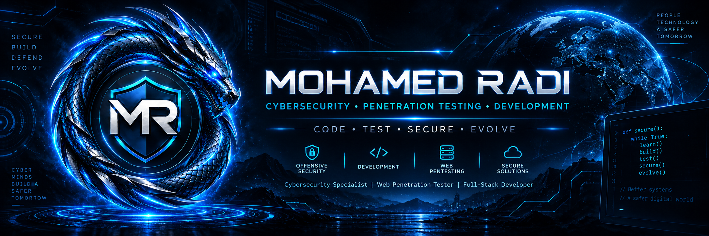

<!-- =========================================================
     MOHAMED RADI
     GITHUB PROFILE README
     CYBER AUTHORITY COMMAND CENTER — V7
     ========================================================= -->

<!-- ===================== HERO BANNER ====================== -->

<p align="center">
  
</p>

<!-- ===================== IDENTITY CORE ==================== -->

<div align="center">

# ⚡ MOHAMED RADI

### `CYBERSECURITY • PENETRATION TESTING • FULL-STACK ENGINEERING`


<br>


<br>


<br><br>

[](https://mohamedradi.is-a.dev)
[](https://github.com/deadsquad21)
[](https://www.linkedin.com/in/mohamedradi-cybersecurity)
[](https://orcid.org/0009-0007-9464-5246)

<br>

[](mailto:contact@mohamedradi.is-a.dev)
[](mailto:info@mohamedradi.is-a.dev)

</div>

<!-- ======================== DIVIDER ======================== -->

<p align="center">
  
</p>

<!-- ===================== QUICK COMMANDS ==================== -->

<div align="center">

## ⚡ COMMAND NAVIGATION

[](#about)
[](#identity)
[](#security)
[](#stack)
[](#missions)
[](#proof)
[](#lab)
[](#intelligence)
[](#contact)

</div>

---

# 🚨 AUTHORITY FAST PATH

<div align="center">

### `VERIFY IDENTITY → REVIEW SECURITY WORK → INSPECT ENGINEERING → CONTACT`

[](https://github.com/deadsquad21/cybersecurity-lab)
[](https://github.com/deadsquad21/mohamed-radi-portfolio-showcase)
[](https://github.com/deadsquad21/kemetx-showcase)

<br>

[](https://github.com/deadsquad21/security-headers-analyzer)
[](https://github.com/deadsquad21/secure-login-demo)
[](https://github.com/deadsquad21/automation-ai-toolkit)
[](https://github.com/deadsquad21/website-performance-toolkit)

</div>

> **Publication rule:** public repositories show owned code, authorized labs, synthetic demos, or publication-safe project documentation. Private client source code and secrets are not exposed.


<a id="about"></a>

# 🛡️ SYSTEM IDENTITY

```text
┌─────────────────────────────────────────────────────────────┐
│                  MR CYBER COMMAND SYSTEM                    │
└─────────────────────────────────────────────────────────────┘

┌──(root㉿mohamed-radi)-[~]
└─$ whoami

Mohamed Radi

ROLE_01 ........ Cybersecurity Specialist
ROLE_02 ........ Web Penetration Tester
ROLE_03 ........ Full-Stack Developer

PRIMARY_MODE .... SECURE DIGITAL ENGINEERING
LOCATION ........ HURGHADA / EGYPT

┌──(root㉿mohamed-radi)-[~]
└─$ systemctl status professional-core

● professional-core.service

   Loaded: loaded
   Active: active (running)

   SECURITY ............ ACTIVE
   DEVELOPMENT ......... READY
   AUTOMATION .......... ONLINE
   INFRASTRUCTURE ...... STABLE
   PERFORMANCE ......... OPTIMIZED
   ANALYTICS ........... MONITORING
   LEARNING ............ CONTINUOUS
```

I'm a **Cybersecurity Specialist, CEH, Web Penetration Tester and Full-Stack Developer** focused on building, testing, securing and optimizing modern digital systems.

My professional ecosystem connects:

- 🛡️ Cybersecurity
- 🎯 Web Penetration Testing
- 🌐 Web Application Security
- 💻 Full-Stack Development
- 🔐 Secure Development
- ⚙️ Automation
- 🤖 AI-assisted Workflows
- ☁️ Infrastructure
- 🚀 Performance Optimization
- 🔍 Technical SEO
- 📊 Analytics & Digital Optimization
- 🧪 Testing & Validation

> **Security is not a final layer.  
> It is part of the architecture.**

---

# ⚡ MISSION DIRECTIVE

```text
MISSION 01
Build secure digital systems.

MISSION 02
Identify weaknesses before attackers do.

MISSION 03
Create scalable and reliable production platforms.

MISSION 04
Combine cybersecurity with modern software engineering.

MISSION 05
Automate repetitive digital workflows.

MISSION 06
Improve performance, discoverability and reliability.

MISSION 07
Keep learning. Keep testing. Keep evolving.
```

<div align="center">

### `CODE → TEST → SECURE → OPTIMIZE → DEPLOY → EVOLVE`

</div>

---

<a id="identity"></a>

# 🪪 PROFESSIONAL IDENTITY NODE

<div align="center">

[](https://orcid.org/0009-0007-9464-5246)

[](https://mohamedradi.is-a.dev)

[](https://www.linkedin.com/in/mohamedradi-cybersecurity)

</div>

```text
╔══════════════════════════════════════════════════════╗
║              PROFESSIONAL IDENTITY                  ║
╠══════════════════════════════════════════════════════╣
║ Name .............. Mohamed Radi                    ║
║ ORCID ............. 0009-0007-9464-5246             ║
║ Country ........... Egypt                           ║
║ Location .......... Hurghada                        ║
║ Discipline ........ Cybersecurity                   ║
║ Engineering ....... Full-Stack Development          ║
║ Identity .......... ACTIVE                          ║
╚══════════════════════════════════════════════════════╝
```

---

# 🕸️ DIGITAL IDENTITY GRAPH

```text
                    ┌─────────────────────────────┐
                    │       MOHAMED RADI          │
                    │  Cybersecurity + Engineering│
                    └──────────────┬──────────────┘
                                   │
          ┌────────────────────────┼────────────────────────┐
          │                        │                        │
          ▼                        ▼                        ▼
   OFFICIAL PORTFOLIO          GITHUB CORE              ORCID ID
 mohamedradi.is-a.dev       @deadsquad21        0009-0007-9464-5246
          │                        │                        │
          └────────────────────────┼────────────────────────┘
                                   ▼
                         PROFESSIONAL NETWORK
                               LinkedIn
```

**Canonical professional identity**

- **Name:** Mohamed Radi
- **Primary discipline:** Cybersecurity
- **Engineering:** Secure Full-Stack Development
- **Public technical identity:** `deadsquad21`
- **Brand:** MR — Secure Digital Solutions
- **Location:** Hurghada, Egypt

This identity graph is intended to keep the same professional entity consistent across the portfolio, GitHub, LinkedIn, ORCID, project documentation and future technical publications.

---

# 🏅 PROFESSIONAL SIGNALS

<div align="center">


</div>

<br>

```text
[ PROFESSIONAL SIGNAL MATRIX ]

[+] CEH Certified
[+] ORCID Registered Professional Identity
[+] 198 WPM Typing Speed
[+] 99.2% Typing Accuracy
[+] English — B2 / Upper Intermediate

[+] Production Web Development
[+] Web Application Security
[+] Security-focused Engineering
[+] Technical SEO
[+] Performance Optimization
[+] Production Deployment
[+] Infrastructure Management
[+] Automation Workflows
[+] AI-assisted Engineering
```

---

# 🎛️ CYBER OPERATIONS DASHBOARD

| SYSTEM | MODE | STATUS | OBJECTIVE |
|:---|:---:|:---:|:---|
| 🛡️ Security Core | Defense | `ACTIVE` | Hardening & Validation |
| 🎯 Pentest Engine | Offensive | `READY` | Web Security Testing |
| 🌐 Application Security | Defense | `ACTIVE` | Secure Web Systems |
| 💻 Development Core | Engineering | `ONLINE` | Full-Stack Systems |
| ⚙️ Automation Engine | Operations | `ONLINE` | Process Optimization |
| 🖥️ Infrastructure | Production | `STABLE` | Hosting & Deployment |
| 🚀 Performance | Optimization | `OPTIMIZED` | Speed & Reliability |
| 🔍 SEO Engine | Discovery | `ACTIVE` | Technical SEO |
| 🤖 AI Workflows | Automation | `ACTIVE` | Intelligent Workflows |
| 📊 Analytics | Intelligence | `MONITORING` | Measurement |
| 🧪 Testing | Validation | `ENABLED` | Quality Assurance |

---

# 📡 SYSTEM TELEMETRY

```text
┌───────────────────────────────────────────────────────────┐
│ SYSTEM TELEMETRY                                         │
├───────────────────────────────────────────────────────────┤
│ Security Engine ................. ██████████ ACTIVE       │
│ Development Core ................ ██████████ ONLINE       │
│ Infrastructure .................. █████████░ STABLE       │
│ Automation ...................... ██████████ ONLINE       │
│ Performance ..................... ██████████ OPTIMIZED    │
│ SEO ............................. █████████░ ACTIVE       │
│ Analytics ....................... ████████░░ MONITORING   │
│ Learning Engine ................. ██████████ CONTINUOUS   │
└───────────────────────────────────────────────────────────┘
```

---

<a id="stack"></a>

# 🧰 TECHNOLOGY ARSENAL

## 🌐 Frontend Systems

<div align="center">


</div>

<br>

<div align="center">


</div>

<details>
<summary><b>⚡ Frontend Capability Matrix</b></summary>

<br>

```text
[+] Responsive Web Design
[+] Component Architecture
[+] Modern JavaScript
[+] TypeScript
[+] React
[+] Next.js
[+] Accessibility
[+] Performance Optimization
[+] Technical SEO
[+] Mobile-first Engineering
[+] Production UI Systems
```

</details>

---

## ⚙️ Backend & Automation

<div align="center">


</div>

<details>
<summary><b>⚙️ Backend Operations</b></summary>

<br>

```text
[+] Node.js
[+] Python
[+] Bash
[+] API Workflows
[+] System Automation
[+] Process Automation
[+] Workflow Engineering
[+] AI-assisted Processes
[+] Integration Logic
[+] Server-side Operations
```

</details>

---

## 🗄️ Data Layer

<div align="center">


</div>

<details>
<summary><b>🗄️ Data Systems</b></summary>

```text
PostgreSQL
MySQL
Supabase
Relational Data
Backend Services
Production Data Workflows
Data-driven Applications
```

</details>

---

## ☁️ Infrastructure / DevOps

<div align="center">


</div>

<br>

<div align="center">


</div>

---

<a id="security"></a>

# 🛡️ CYBERSECURITY COMMAND CENTER

<div align="center">


</div>

---

## 🎯 Offensive Security Node

```text
TARGET MODULES:

[+] Web Penetration Testing
[+] Reconnaissance
[+] Vulnerability Assessment
[+] Attack Surface Review
[+] Authentication Testing
[+] Authorization Testing
[+] Security Validation
```

---

## 🌐 Application Security Node

```text
[+] OWASP Testing Methodologies
[+] Web Application Security
[+] Input Validation Testing
[+] Session Security Review
[+] Authentication Review
[+] Authorization Controls
[+] Exposure Assessment
[+] Security Misconfiguration Review
```

---

## 🔐 Secure Engineering Node

```text
[+] Secure Development
[+] Security Hardening
[+] Security-focused Code Review
[+] Production Security
[+] Infrastructure Security
[+] Deployment Security
[+] Security Validation
```

---

## 🧠 Security Philosophy

```text
┌──────────────────────────────────────────────────────┐
│                                                      │
│    SECURITY IS NOT A PATCH.                          │
│                                                      │
│    SECURITY IS ARCHITECTURE.                         │
│                                                      │
│    DESIGN IT.                                        │
│    TEST IT.                                          │
│    BREAK ASSUMPTIONS.                                │
│    HARDEN IT.                                        │
│    MONITOR IT.                                       │
│    IMPROVE IT.                                       │
│                                                      │
└──────────────────────────────────────────────────────┘
```

---

# 💻 ENGINEERING COMMAND

```text
┌────────────────────────────────────────────────────────────┐
│               DIGITAL ENGINEERING CORE                     │
├────────────────────────────────────────────────────────────┤
│ Secure Architecture                                       │
│ Clean Code                                                │
│ Responsive Design                                         │
│ Performance                                               │
│ Scalability                                               │
│ Accessibility                                             │
│ Technical SEO                                             │
│ Analytics                                                 │
│ Deployment                                                │
│ Production Reliability                                    │
│ Continuous Improvement                                    │
└────────────────────────────────────────────────────────────┘
```

<div align="center">

### `BUILD → TEST → SECURE → OPTIMIZE → DEPLOY → MONITOR → EVOLVE`

<br>


<br>


</div>

---

# 🧪 ENGINEERING PIPELINE

```text
IDEA
  │
  ▼
REQUIREMENTS
  │
  ▼
ARCHITECTURE
  │
  ▼
THREAT THINKING
  │
  ▼
DEVELOPMENT
  │
  ▼
TESTING
  │
  ▼
SECURITY VALIDATION
  │
  ▼
PERFORMANCE OPTIMIZATION
  │
  ▼
SEO VALIDATION
  │
  ▼
DEPLOYMENT
  │
  ▼
MONITORING
  │
  ▼
ANALYTICS
  │
  ▼
CONTINUOUS IMPROVEMENT
```

---

---

<a id="proof"></a>

# 🧾 PROFESSIONAL PROOF LAYER

The profile is designed around **verifiable public work**, not unsupported claims.

| PUBLIC PROOF | TYPE | STATUS | WHAT IT DEMONSTRATES |
|:---|:---|:---:|:---|
| [`cybersecurity-lab`](https://github.com/deadsquad21/cybersecurity-lab) | Security engineering | `PUBLIC` | Authorized labs, hardening, methodology, defensive tooling |
| [`security-headers-analyzer`](https://github.com/deadsquad21/security-headers-analyzer) | Python security tool | `PUBLIC` | Defensive HTTP security analysis |
| [`secure-login-demo`](https://github.com/deadsquad21/secure-login-demo) | Secure development demo | `PUBLIC` | Authentication, session and secure coding concepts |
| [`mohamed-radi-portfolio-showcase`](https://github.com/deadsquad21/mohamed-radi-portfolio-showcase) | Professional showcase | `PUBLIC` | Engineering portfolio documentation |
| [`kemetx-showcase`](https://github.com/deadsquad21/kemetx-showcase) | Project showcase | `PUBLIC` | Tourism platform, booking UX, SEO and performance |
| [`automation-ai-toolkit`](https://github.com/deadsquad21/automation-ai-toolkit) | Automation | `PUBLIC` | Reproducible workflows and safe integration architecture |
| [`website-performance-toolkit`](https://github.com/deadsquad21/website-performance-toolkit) | Performance engineering | `PUBLIC` | HTTP timing, resource auditing, optimization guidance, JSON reporting and CI-tested Python tooling |

> The six core proof repositories referenced below are now published publicly on GitHub.

> **Extended proof layer:** `website-performance-toolkit` adds a seventh public engineering artifact focused on measurable web-performance analysis without claiming unmeasured Lighthouse or Core Web Vitals data.

## Proof Standard

```text
CLAIM
  ↓
PUBLIC ARTIFACT / VERIFIED IDENTITY
  ↓
DOCUMENTED SCOPE
  ↓
REPRODUCIBLE METHOD
  ↓
SAFE EVIDENCE
  ↓
NO PRIVATE CLIENT DATA
```

No invented performance figures.  
No invented client results.  
No private source-code publication.  
No security testing claims without an authorized environment or evidence.


<a id="missions"></a>

# 🚀 MISSION ARCHIVE

## 🌍 KemetX Tours


**Mission**

Build and evolve a production tourism platform focused on experiences, excursions and digital booking journeys.

**Systems**

`TypeScript` `Web Development` `Technical SEO` `Performance` `UX` `Mobile Experience`

🌐 **Live System:**  
### [kemetxtours.com →](https://www.kemetxtours.com/)

---

## 🧭 Mohamed Radi Digital Ecosystem


Professional cybersecurity and digital engineering ecosystem.

**Systems**

`Cybersecurity` `Full-Stack` `Technical SEO` `Performance` `Brand Engineering`

🌐  
### [mohamedradi.is-a.dev →](https://mohamedradi.is-a.dev)

---

## 🌴 Crazy Adventures


Tourism platform engineering focused on mobile booking, analytics and digital infrastructure.

**Systems**

`Web Engineering` `Analytics` `Booking UX` `Infrastructure` `Mobile`

---

## ✈️ Warner Tours


Travel platform focused on performance, usability and digital customer experience.

**Systems**

`React` `Vercel` `Analytics` `Performance`

---

# 🌌 PROJECT UNIVERSE

<details>
<summary><b>🚀 Expand Project Systems</b></summary>

<br>

### Production / Client Systems

- KemetX
- Crazy Adventures
- Warner Tours
- A1Car
- Ahmed Badry
- Arto Tattoo
- Crimson Sands
- El Ghazy
- Memo Aqua
- Pedo Nana
- Roro Rosta

<br>

### Engineering Focus

```text
Web Platforms
Tourism Systems
Secure Web Development
Responsive Experiences
Booking UX
Performance Optimization
Infrastructure
Analytics
SEO Engineering
Automation
```

</details>

---

# ⚡ WEBSITE PERFORMANCE ENGINEERING TOOLKIT

<div align="center">

[](https://github.com/deadsquad21/website-performance-toolkit)
[](https://github.com/deadsquad21/website-performance-toolkit/actions/workflows/ci.yml)

</div>

**Public working MVP for lightweight website-performance analysis.**

```text
WEB PAGE
   │
   ▼
HTTP REQUEST MEASUREMENT
   │
   ├── Response-header timing
   ├── Body-download timing
   └── Total request timing
   │
   ▼
RESOURCE AUDIT
   │
   ├── Scripts
   ├── Stylesheets
   ├── Images
   ├── Preloads
   └── Potentially blocking scripts
   │
   ▼
DELIVERY SIGNALS
   │
   ├── HTML transfer size
   ├── Compression headers
   └── Cache-control headers
   │
   ▼
OPTIMIZATION GUIDANCE
   │
   ▼
JSON REPORT / CI WORKFLOW
```

### Engineering Boundary

- Reports only measurements the tool actually collects.
- Does **not** invent Lighthouse scores.
- Does **not** claim to measure LCP, INP, CLS or other Core Web Vitals without browser/RUM data.
- Supports offline saved-HTML analysis.
- Includes automated Python tests through GitHub Actions.
- Intended for owned or authorized targets only.

**Repository:**  
### [github.com/deadsquad21/website-performance-toolkit →](https://github.com/deadsquad21/website-performance-toolkit)

---

<a id="lab"></a>

# 🧪 SECURITY LAB GATEWAY

<div align="center">

[](https://github.com/deadsquad21/cybersecurity-lab)

</div>

The public lab is structured for **authorized and defensive** security work:

```text
cybersecurity-lab/
├── labs/
│   └── web-security/
├── methodologies/
├── checklists/
├── tools/
│   ├── headers-analyzer/
│   └── file-integrity/
├── research/
├── writeups/
├── evidence/
├── ETHICS.md
└── SECURITY.md
```

### Lab Rules

- Owned systems or explicit authorization only.
- Prefer isolated / intentionally vulnerable lab environments.
- No real client credentials, tokens, private code or sensitive data.
- Findings must include remediation, limitations and retest status where appropriate.
- Public write-ups must be sanitized before publication.

### First Working Defensive Tool

[`security-headers-analyzer`](https://github.com/deadsquad21/security-headers-analyzer)

```text
HTTP RESPONSE
     │
     ▼
HEADER NORMALIZATION
     │
     ▼
DEFENSIVE CONTROL REVIEW
     │
     ├── Content-Security-Policy
     ├── HSTS
     ├── X-Content-Type-Options
     ├── Referrer-Policy
     ├── Permissions-Policy
     └── Clickjacking protection
     │
     ▼
REMEDIATION GUIDANCE
```

---

# 🔬 CURRENT OPERATIONS

```text
[ CURRENT OPERATIONS ]

→ Secure Web Architecture
→ Web Application Security
→ Penetration Testing
→ Full-Stack Engineering
→ Production Infrastructure
→ AI-assisted Automation
→ Technical SEO
→ Performance Optimization
→ Website Performance Analysis Tooling
→ Analytics & Conversion Improvement
→ Security Skill Development
→ Production Reliability
```

---

# 🧠 ENGINEERING PRINCIPLES

| PRINCIPLE | ENGINEERING APPROACH |
|:---|:---|
| 🔐 Security | Engineer it from the beginning |
| 🚀 Performance | Architecture before patches |
| 📱 Responsive | Design intentionally for each screen |
| ♿ Accessibility | Build for real users |
| 🔍 SEO | Engineer discoverability |
| ⚙️ Automation | Remove repetitive work |
| 🧪 Testing | Validate before production |
| 📊 Analytics | Measure what matters |
| 🛡️ Privacy | Respect data boundaries |
| 📈 Improvement | Measure → Learn → Improve |

---

---

# 📌 REPOSITORY COMMAND MATRIX

Recommended public pin architecture after publication:

| POSITION | REPOSITORY | ROLE |
|:---:|:---|:---|
| `01` | `cybersecurity-lab` | Primary cybersecurity proof |
| `02` | `mohamed-radi-portfolio-showcase` | Professional identity & engineering showcase |
| `03` | `kemetx-showcase` | Real project documentation |
| `04` | `security-headers-analyzer` | Working defensive security tool |
| `05` | `secure-login-demo` | Secure application engineering demo |
| `06` | `automation-ai-toolkit` | Automation / AI workflow engineering |

### Additional Public Engineering Proof

[](https://github.com/deadsquad21/website-performance-toolkit)

`website-performance-toolkit` is part of the public proof layer and can be rotated into the six GitHub profile pins whenever performance engineering should be emphasized.

```text
SECURITY PROOF      ENGINEERING IDENTITY
      │                     │
      ├──────────┬──────────┤
      │          │          │
 REAL PROJECT  SECURITY    SECURE APP
  SHOWCASE       TOOL        DEMO
      │          │          │
      └──────────┴──────────┘
                 │
          AUTOMATION SYSTEMS
```

`register` can remain public if required for the `is-a.dev` domain workflow, but it should not occupy a primary portfolio pin.

<a id="intelligence"></a>

# 📊 GITHUB INTELLIGENCE CENTER

<div align="center">


<br><br>


<br><br>


</div>

---

# 🔥 DEVELOPMENT STREAK

<div align="center">


</div>

---

# 👁️ PROFILE TELEMETRY

<div align="center">


</div>

---

# 🎯 CURRENT MISSION

```bash
┌──(root㉿mohamed-radi)-[~/mission]
└─$ sudo ./execute-mission.sh

[*] Build secure digital products
[*] Improve offensive security knowledge
[*] Develop scalable web platforms
[*] Automate repetitive workflows
[*] Strengthen production infrastructure
[*] Optimize technical SEO
[*] Improve application performance
[*] Build measurable website performance tooling
[*] Expand automation capabilities
[*] Improve analytics
[*] Create technology that solves real problems

[IDENTITY] .............. REGISTERED
[SECURITY] .............. ACTIVE
[DEVELOPMENT] ........... READY
[INFRASTRUCTURE] ........ STABLE
[AUTOMATION] ............ ONLINE
[PERFORMANCE] ........... OPTIMIZED
[ANALYTICS] ............. MONITORING
[LEARNING] .............. CONTINUOUS
[MISSION] ............... IN PROGRESS

[SYSTEM] ................ ONLINE
```

---

# 🤝 COLLABORATION MATRIX

<div align="center">


<br>


</div>

<br>

Professional collaboration areas:

- Cybersecurity projects
- Web security assessments
- Secure web development
- Full-stack engineering
- Infrastructure
- Performance optimization
- Technical SEO
- Automation
- AI-assisted workflows
- Digital transformation

---

---

# 🔏 PUBLICATION & CLIENT-SAFETY POLICY

<details>
<summary><b>Open publication rules</b></summary>

<br>

### Public by default

- Original demo code created for the public portfolio
- Authorized lab documentation
- Defensive tools
- Synthetic datasets
- Public website screenshots approved for showcase use
- High-level architecture that reveals no sensitive implementation detail

### Private by default

- Client source code
- Credentials / API keys / tokens
- Customer or traveler data
- Private analytics exports
- Infrastructure secrets
- Vulnerability details from real engagements without publication approval
- Commercially sensitive internal documents

### Project labels

Every showcased system should be clearly labeled:

`LIVE` • `DEMO` • `CONCEPT` • `PRIVATE / SHOWCASE ONLY`

</details>

<a id="contact"></a>

# 📡 SECURE COMMUNICATION CHANNEL

<div align="center">

### 🔵 PRIMARY BUSINESS CHANNEL

[](mailto:contact@mohamedradi.is-a.dev)

<br>

### 🔷 GENERAL INFORMATION

[](mailto:info@mohamedradi.is-a.dev)

<br>

### 🔴 SECONDARY CHANNEL

[](mailto:mradihack@gmail.com)

<br>

### 🟢 PROFESSIONAL IDENTITY

[](https://orcid.org/0009-0007-9464-5246)

<br>

### 🌐 DIGITAL NODES

[](https://mohamedradi.is-a.dev)
[](https://www.linkedin.com/in/mohamedradi-cybersecurity)
[](https://github.com/deadsquad21)

</div>

---

# ⚡ FINAL SYSTEM CORE

<div align="center">

```text
╔══════════════════════════════════════════════════════════════╗
║                                                              ║
║                 M O H A M E D   R A D I                      ║
║                                                              ║
║                 SECURE DIGITAL SOLUTIONS                     ║
║                                                              ║
╠══════════════════════════════════════════════════════════════╣
║                                                              ║
║ IDENTITY ................. REGISTERED                        ║
║ SECURITY ................. ACTIVE                            ║
║ PENETRATION TESTING ...... READY                             ║
║ DEVELOPMENT .............. ONLINE                            ║
║ AUTOMATION ............... ONLINE                            ║
║ INFRASTRUCTURE ........... STABLE                            ║
║ PERFORMANCE .............. OPTIMIZED                         ║
║ SEO ...................... ACTIVE                            ║
║ ANALYTICS ................ MONITORING                        ║
║ CONTACT .................. OPEN                              ║
║                                                              ║
║ ORCID .... 0009-0007-9464-5246                               ║
║                                                              ║
║ SYSTEM STATUS ............ ONLINE                            ║
║                                                              ║
╚══════════════════════════════════════════════════════════════╝
```

# 🐉 MR — SECURE DIGITAL SOLUTIONS

### `CODE • TEST • SECURE • EVOLVE`

### Built for the digital world. Engineered for what comes next.

<br>

## [⚡ ENTER THE SYSTEM →](https://mohamedradi.is-a.dev)

<br>


<br><br>

**CYBERSECURITY • PENETRATION TESTING • DEVELOPMENT**  
**AUTOMATION • INFRASTRUCTURE • PERFORMANCE**

</div>

<!-- ================= ANIMATED EXIT ================= -->

<p align="center">
  
</p>

<!-- =========================================================
     END — MOHAMED RADI CYBER AUTHORITY V7
     SYSTEM ONLINE
     ========================================================= -->
